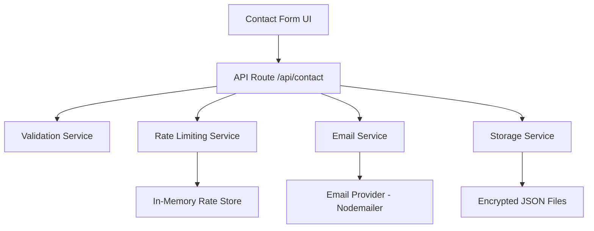

# Design Document: Contact Form Backend Integration

## Overview

This design implements a robust backend system for the portfolio contact form using Next.js API routes with JavaScript, email services, and local storage. The system provides secure message handling, email notifications, spam prevention, and data persistence while maintaining a clean separation of concerns.

## Architecture

The system follows a layered architecture with clear separation between the presentation layer (React component), API layer (Next.js API routes), service layer (email and storage services), and data layer (local file storage with encryption).



## Components and Interfaces

### Contact Form Component (Frontend)

- **Purpose**: Enhanced UI component with backend integration
- **Key Changes**: Add loading states, success/error messaging, form reset
- **State Management**: Track submission status, loading state, and user feedback
- **Error Handling**: Display validation errors and network errors to users

### API Route Handler

- **Endpoint**: `/api/contact`
- **Method**: POST
- **Request Schema**:

```javascript
// ContactRequest object structure
{
  name: string,
  email: string,
  message: string
}
```

- **Response Schema**:

```javascript
// ContactResponse object structure
{
  success: boolean,
  message: string,
  id: string // submission ID on success (optional)
}
```

### Validation Service

- **Input Sanitization**: HTML encoding, trim whitespace, length limits
- **Email Validation**: RFC-compliant email format validation
- **Content Filtering**: Basic profanity and spam pattern detection
- **Security**: XSS prevention through input sanitization

### Email Service

- **Provider**: Nodemailer with SMTP configuration
- **Template System**: HTML email templates with sender information
- **Configuration**: Environment-based SMTP settings (Gmail, SendGrid, etc.)
- **Error Handling**: Graceful degradation if email fails

### Storage Service

- **Format**: Encrypted JSON files in `/data/messages/` directory
- **Encryption**: AES-256 encryption for sensitive data
- **File Structure**: One file per day (YYYY-MM-DD.json) for organization
- **Backup Strategy**: Automatic file rotation and cleanup

### Rate Limiting Service

- **Strategy**: In-memory store with IP-based tracking
- **Limits**: 3 submissions per hour per IP address
- **Cleanup**: Automatic cleanup of expired entries
- **Persistence**: Optional Redis integration for production scaling

## Data Models

### Message Model

```javascript
// ContactMessage object structure
{
  id: string,
  name: string,
  email: string,
  message: string,
  timestamp: Date,
  ipAddress: string,
  userAgent: string, // optional
  status: 'pending' | 'sent' | 'failed'
}
```

### Rate Limit Entry

```javascript
// RateLimitEntry object structure
{
  ipAddress: string,
  submissions: number,
  windowStart: Date,
  lastSubmission: Date
}
```

### Email Template Data

```javascript
// EmailTemplateData object structure
{
  senderName: string,
  senderEmail: string,
  message: string,
  timestamp: string,
  ipAddress: string,
  submissionId: string
}
```

## Correctness Properties

_A property is a characteristic or behavior that should hold true across all valid executions of a system-essentially, a formal statement about what the system should do. Properties serve as the bridge between human-readable specifications and machine-verifiable correctness guarantees._

### Property 1: Form Submission Data Integrity

_For any_ valid contact form data (name, email, message), when submitted through the form, the API should receive exactly the same data without modification or loss.
**Validates: Requirements 1.1**

### Property 2: UI State Consistency During Submission

_For any_ form submission attempt, the UI should show loading state during the request and return to normal state after completion (success or failure).
**Validates: Requirements 1.4**

### Property 3: Input Validation Completeness

_For any_ form submission with invalid data (empty name, invalid email, empty message, or oversized message), the validation system should reject it and provide appropriate error feedback.
**Validates: Requirements 2.1, 2.2, 2.3, 2.4**

### Property 4: XSS Prevention

_For any_ input containing potential XSS payloads, the validation system should sanitize the input such that no executable code remains in the processed data.
**Validates: Requirements 2.5**

### Property 5: Email Notification Completeness

_For any_ valid message submission, the email notification should contain all required fields (sender name, email, message content) and be formatted according to the template.
**Validates: Requirements 3.1, 3.2, 3.4**

### Property 6: Storage Data Completeness

_For any_ valid message submission, the stored record should contain all required fields (name, email, message, timestamp, IP address) and be encrypted.
**Validates: Requirements 4.1, 4.2, 4.4**

### Property 7: Rate Limiting Enforcement

_For any_ IP address, after 3 submissions within 1 hour, subsequent submissions should be rejected with appropriate error messages until the time window resets.
**Validates: Requirements 5.1, 5.2, 5.3**

### Property 8: API Response Consistency

_For any_ API request, the response should include appropriate HTTP status codes, CORS headers, and be logged for monitoring.
**Validates: Requirements 6.2, 6.3, 6.4, 6.5**

### Property 9: Graceful Degradation

_For any_ message submission, if storage fails but email succeeds, the user should receive success confirmation, and if email fails but storage succeeds, the user should receive an error message.
**Validates: Requirements 4.3, 3.3**

### Property 10: Encryption Round Trip

_For any_ message data, encrypting then decrypting should produce the original data, ensuring data integrity in storage.
**Validates: Requirements 4.4**

## Error Handling

### Frontend Error Handling

- **Network Errors**: Display user-friendly messages for connection issues
- **Validation Errors**: Show field-specific error messages inline
- **Rate Limiting**: Inform users about submission limits and retry timing
- **Server Errors**: Provide generic error message while logging details

### Backend Error Handling

- **Validation Failures**: Return 400 status with detailed field errors
- **Rate Limiting**: Return 429 status with retry-after header
- **Email Service Failures**: Log errors, continue with storage, return 500 if critical
- **Storage Failures**: Log errors, continue with email, return 500 if critical
- **Unexpected Errors**: Log full stack trace, return generic 500 response

### Logging Strategy

- **Request Logging**: All API requests with timestamp, IP, and user agent
- **Error Logging**: Structured error logs with context and stack traces
- **Security Logging**: Failed validation attempts and rate limit violations
- **Performance Logging**: Response times and service health metrics

## Testing Strategy

### Unit Testing

- **Validation Functions**: Test input sanitization and validation rules
- **Email Service**: Test email formatting and sending logic (with mocks)
- **Storage Service**: Test encryption, file operations, and data integrity
- **Rate Limiting**: Test counting, window management, and cleanup
- **API Routes**: Test request handling, response formatting, and error cases

### Property-Based Testing

Property-based tests will validate universal correctness properties using generated test data. Each test will run a minimum of 100 iterations to ensure comprehensive coverage across the input space.

**Testing Framework**: We'll use `fast-check` for JavaScript property-based testing, integrated with Jest for the test runner.

**Test Configuration**:

- Minimum 100 iterations per property test
- Custom generators for form data, email addresses, and message content
- Edge case generators for boundary conditions and malicious inputs
- Each test tagged with format: **Feature: contact-form-backend, Property {number}: {property_text}**

**Key Property Tests**:

- Form data integrity across submission pipeline
- Validation consistency across all input combinations
- Rate limiting behavior across time windows and IP addresses
- Encryption/decryption round-trip properties
- API response consistency across all request types

### Integration Testing

- **End-to-End Form Flow**: Submit form and verify email delivery and storage
- **Error Scenarios**: Test various failure modes and recovery
- **Rate Limiting Integration**: Test actual rate limiting with time delays
- **CORS Functionality**: Test cross-origin requests from frontend

### Security Testing

- **XSS Prevention**: Test with various XSS payloads
- **Input Validation**: Test with malformed and malicious inputs
- **Rate Limiting**: Test with automated submission attempts
- **Data Encryption**: Verify sensitive data is never stored in plaintext
